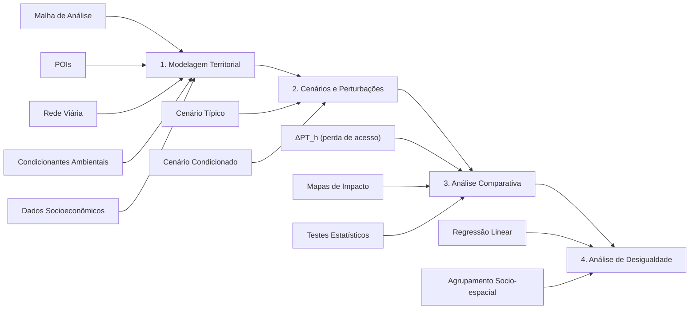

# ambx — Ambient Access

**Framework para avaliação da acessibilidade urbana de curta distância sob perturbações ambientais.**

> Dissertação de Mestrado — Análise multifatorial da acessibilidade a pontos de interesse urbanos, considerando tempos de acesso, morfologia, eventos climáticos atípicos e fatores socioeconômicos.

---

## Visão Geral

O **ambx** (*Ambient Access*) é um framework em Python que modela e analisa como perturbações ambientais e climáticas (inundações, chuvas intensas, escorregamentos) afetam a acessibilidade urbana — e como esses impactos se distribuem desigualmente entre diferentes perfis socioeconômicos da população.

A abordagem metodológica consiste em comparar quantitativamente dois cenários da rede de deslocamento:

1. **Cenário Típico** — condições normais de mobilidade, onde o custo de cada aresta é apenas o comprimento do trecho.
2. **Cenário Condicionado** — a rede tem seus custos penalizados por camadas ambientais (rasters de temperatura, polígonos de alagamento, etc.), simulando a degradação da mobilidade.

A diferença entre os indicadores de acessibilidade nos dois cenários revela **onde**, **quanto** e **para quem** a acessibilidade é perdida.

---

## Estrutura do Projeto

```
dissertacao/
├── app/
│   └── prototype.py            # Protótipo interativo (Streamlit)
├── scripts/
│   └── ambx/                   # Biblioteca principal
│       ├── __init__.py          # Versão 0.1.0
│       ├── grid.py              # Geração de malha territorial
│       ├── utils.py             # Utilitários geoespaciais (CRS UTM)
│       ├── demographics.py      # Dados censitários e interpolação areal
│       ├── network.py           # Grafo viário e snapping
│       ├── pois.py              # Coleta de Pontos de Interesse
│       ├── environment.py       # Camadas ambientais (raster / vetorial)
│       ├── penalties.py         # Penalização ambiental de arestas
│       ├── routing.py           # Roteamento A* com paralelismo
│       └── indicators.py        # Indicadores PTh, Gini e F15
│   └── extract/
│       └── download_censo_2022.py  # EL do Censo Demográfico 2022
├── notebooks/
│   ├── ambx_tests_porto_alegre.ipynb  # Testes e experimentos (POA)
│   └── qualifying/
│       ├── generate_simulated_flood_areas..ipynb
│       └── generate_simulated_scenarios.ipynb
├── data/
│   └── raw/
│       ├── censo_2022/          # Censo Demográfico 2022 (GeoParquet)
│       ├── curitiba/            # Camadas ambientais de Curitiba
│       └── porto_alegre/        # Camadas ambientais de Porto Alegre
├── cache/                      # Cache de requisições OSM (JSON)
├── docs/
│   └── qualifying/             # Documento de qualificação (LaTeX)
│       ├── main.tex
│       ├── main.pdf
│       ├── refs.bib
│       ├── figs/
│       ├── files/
│       ├── sections/
│       │   ├── 1.introduction.tex
│       │   ├── 2.fundamentals.tex
│       │   ├── 3.methodology.tex
│       │   ├── 4.planning.tex
│       │   ├── 5.results.tex
│       │   └── apendices.tex
│       └── sections_old/
├── requirements.txt
└── README.md
```

---

## Fluxo Metodológico



### Etapas

1. **Modelagem Territorial** — O espaço urbano é representado como um sistema discreto com: malha de análise (hexagonal ou quadrada), rede viária como grafo, pontos de interesse categorizados e dados socioeconômicos compatibilizados.
2. **Cenários e Perturbações** — Aplicação de funções de penalização ambiental sobre os custos das arestas. Cálculo de indicadores (PTh, Índice G, F15) para ambos os cenários.
3. **Análise Comparativa** — Quantificação das perdas de acessibilidade (Δ absoluto e relativo), mapeamento espacial dos impactos e validação estatística.
4. **Análise de Desigualdade** — Cruzamento das perdas com dados de renda, escolaridade e densidade populacional via regressão e agrupamento socio-espacial.

### Indicadores

| Indicador | Descrição |
|-----------|-----------|
| **PTh** (*Proximity Time*) | Tempo médio para alcançar os *k* POIs mais próximos de cada categoria, por célula da malha |
| **Índice G** | Coeficiente de Gini da distribuição de acessibilidade entre territórios ou grupos |
| **F15** | Fração da população residente em zonas onde PTh ≤ 15 minutos |

---

## Instalação

```bash
# Clone o repositório
git clone https://github.com/izidoromth/dissertacao.git
cd dissertacao

# Crie e ative o ambiente virtual
python -m venv .venv
source .venv/bin/activate

# Instale as dependências
pip install -r requirements.txt
```

### Dependências principais

- Python ≥ 3.10
- [osmnx](https://github.com/gboeing/osmnx) — acesso ao OpenStreetMap
- [geopandas](https://geopandas.org/) — manipulação de dados geoespaciais
- [shapely](https://shapely.readthedocs.io/) — operações geométricas
- [networkx](https://networkx.org/) — grafos e algoritmos de caminho mínimo
- [pandas](https://pandas.org/) — manipulação de dados tabulares
- [numpy](https://numpy.org/) — computação numérica
- [streamlit](https://streamlit.io/) — protótipo interativo
- [folium](https://python-visualization.github.io/folium/) — mapas interativos Leaflet
- [scikit-learn](https://scikit-learn.org/) — aprendizado de máquina
- [scipy](https://scipy.org/) — computação científica

### Dependências opcionais (comparison / inequality)

- [statsmodels](https://www.statsmodels.org/) — regressão com p-valores e diagnóstico
- [esda](https://pysal.org/esda/) — estatísticas de autocorrelação espacial (I de Moran)

---

## Uso

### Protótipo Interativo (Streamlit)

```bash
streamlit run app/prototype.py
```

O protótipo oferece duas visões:

1. **Preparação de Dados** — vizualização da malha territorial, rede viária, POIs e snapping.
2. **Tempos Médios (A\*)** — cálculo da matriz origem-destino com A* paralelizado e mapa de calor por tempo de acesso.

### Como biblioteca Python

```python
from ambx.grid import generate_grid, GridFormat
from ambx.pois import get_pois

# Gerar malha hexagonal de 500m para uma cidade
grid = generate_grid("Curitiba, Parana, Brazil",
                     grid_format=GridFormat.HEXAGON,
                     cell_size=500)

# Coletar pontos de interesse
pois = get_pois("Curitiba, Parana, Brazil", buffer=2000)
```

---

## Status da Implementação — `ambx`

| Módulo | Status | Descrição |
|--------|:------:|-----------|
| `grid` | ✅ | Geração de malha territorial (hexagonal e quadrada), recorte por contorno administrativo, reprojeção UTM→WGS84 |
| `utils` | ✅ | Determinação do CRS UTM adequado à localização |
| `network` | ✅ | Construção do grafo viário a partir do OSM, projeção para CRS métrico, vinculação (snapping) dos centróides da malha à rede |
| `pois` | ✅ | Coleta e categorização de Pontos de Interesse do OSM (saúde, educação, transporte, alimentação), com buffer para conurbações |
| `routing` | ✅ | Roteamento A* com heurística euclidiana admissível, paralelismo via `multiprocessing.Pool`, matriz origem-destino |
| `environment` | ✅ | Carregamento de camadas ambientais vetoriais (Shapefile, GeoJSON, GeoPackage) e raster (GeoTIFF) com recorte espacial, reamostragem e reprojeção. Container ``EnvironmentLayers`` unificado. Funções: ``load_vector``, ``load_vector_from_gdf``, ``load_raster``, ``load_raster_from_array``, ``raster_stats_for_geometry``, ``sample_raster_at_points``, ``build_environment`` |
| `demographics` | ✅ | Carga de setores censitários (GeoParquet), filtro por município, interpolação areal (`area_weighted` / `density_weighted`) de variáveis do Censo 2022 para a malha regular. Funções: ``load_tracts``, ``filter_by_area``, ``interpolate_to_grid`` |
| `penalties` | ✅ | Funções de penalização ambiental sobre arestas: `PenaltyRule`, `apply_vector_penalty`, `apply_raster_penalty`, `compose_penalties`. Suporte a raster, vetorial, interdição total e composição cumulativa de múltiplas camadas |
| `indicators` | ✅ | Cálculo dos indicadores PTh, Índice G (Gini) e F15 para cada cenário. Funções: `compute_pth`, `compute_pth_wide`, `compute_gini`, `compute_f15`, `compute_all_indicators` |
| `comparison` | ❌ | Análise comparativa entre cenário típico e condicionado (Δ absoluto/relativo, mapas de calor, testes estatísticos) |
| `inequality` | ❌ | Análise de desigualdade socioeconômica (regressão linear, agrupamento socio-espacial) |

**Progresso:** 9 / 11 módulos concluídos (~82%)

### Próximos passos

Os módulos `comparison` e `inequality` serão implementados com base nas dependências já disponíveis (`scikit-learn`, `scipy`, `pandas`, `geopandas`):

**1. `comparison`** — Análise comparativa entre cenário típico e condicionado.
- Delta absoluto e relativo dos indicadores (PTh, Gini, F15) entre cenários
- Testes de hipótese pareados (Wilcoxon / t-pareado via `scipy.stats`)
- Mapeamento espacial das diferenças (ΔPTh por célula)
- Associação local (LISA) para identificar manchas de degradação — exigirá `esda` (PySAL) ou implementação manual

**2. `inequality`** — Análise de desigualdade socioeconômica.
- **Regressão linear MQO** com `statsmodels` (não `sklearn.linear_model`) — porque `statsmodels` fornece p-valores, intervalos de confiança, R² ajustado e diagnóstico de resíduos, essenciais para validar a significância estatística das variáveis socioeconômicas
- **Clusterização socioespacial** via `sklearn.cluster.AgglomerativeClustering` com restrição de contiguidade (matriz de adjacência espacial Queen/Rook) — porque é o método mais adequado para produzir **regiões contíguas e internamente homogêneas**, ao contrário de K-Means que ignora a vizinhança geográfica
- PCA exploratório para redução de dimensionalidade (`sklearn.decomposition.PCA`)

---

## Referências

- Bruno, M. et al. (2024). *The 15-minute city for all? – Measuring individual and temporal variations in walking accessibility*. Journal of Transport Geography.
- Hansen, W. G. (1959). *How accessibility shapes land use*. Journal of the American Institute of Planners.
- Geurs, K. T. & van Wee, B. (2004). *Accessibility evaluation of land-use and transport strategies*. Journal of Transport Geography.
- Cook, S. et al. (2022). *More than walking and cycling: What is 'active travel'?* Transport Policy.
- Lista completa em [`docs/qualifying/refs.bib`](docs/qualifying/refs.bib).

---

## Licença

Este projeto é parte de uma dissertação de mestrado em andamento.
